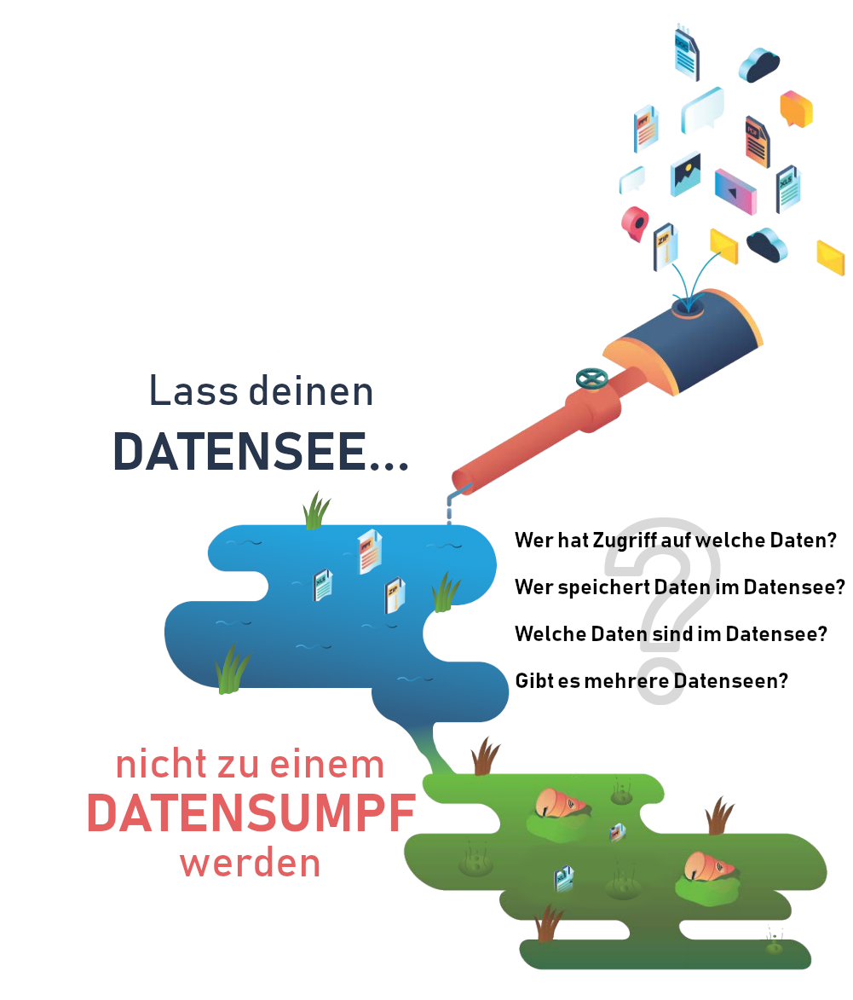

In diesem Tutorial konntest du nun einen Einblick über das JSON-Format in relationalen Datenbanken gewinnen.
Auch wenn das JSON-Format ziemlich praktisch wirkt, solltest du dir nochmals die folgenden Aspekte vor Augen halten:

Die in diesem Tutorial verwendete Speicherart mittels JSON-Dokumente, wird als _Schema-On-Read_ bezeichnet und ist besonders oft im Bereich _Big Data_ zu finden.   
Sie hat verschiedene Vorteile, wie:
- Rohdaten können direkt in der Datenbank gespeichert werden
- Datenstrukturen können später hinzugefügt werden
- Gespeicherte (Sensor-) Daten können verschiedene Formate haben

Allerdings gibt es auch enorme Nachteile aufgrund der unstrukturierten Daten, wie:
- eine schlechte Datenqualität
- doppelte, unnötige, Abfragen die erstellt werden müssen
- Sicherheitsanfälligkeit

Nicht umsonst wird dieses System auch als _Data Lake_ (dt. Datensee) bezeichnet, da in diesem alle verschiedenen und wichtigen Daten gemeinsam gespeichert werden können. Dieser See kann jedoch schnell zu einem _Data Swamp_ (dt. Datensumpf) werden, wenn überhaupt keine Ordnung der Daten gegeben ist, die Daten sehr selten gepflegt werden oder die Daten nicht Dokumentiert sind. Und um aus einem Sumpf wieder einen See zu machen, wir sehr viel Arbeit und Zeit benötigt.

